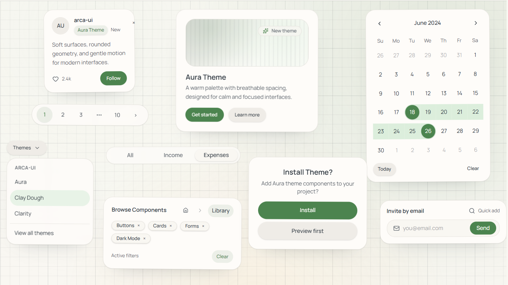
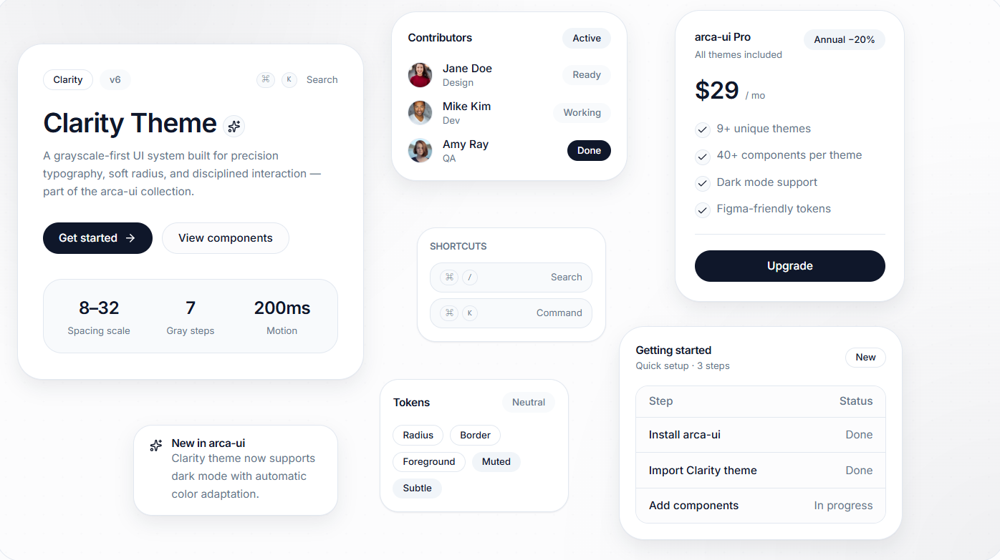
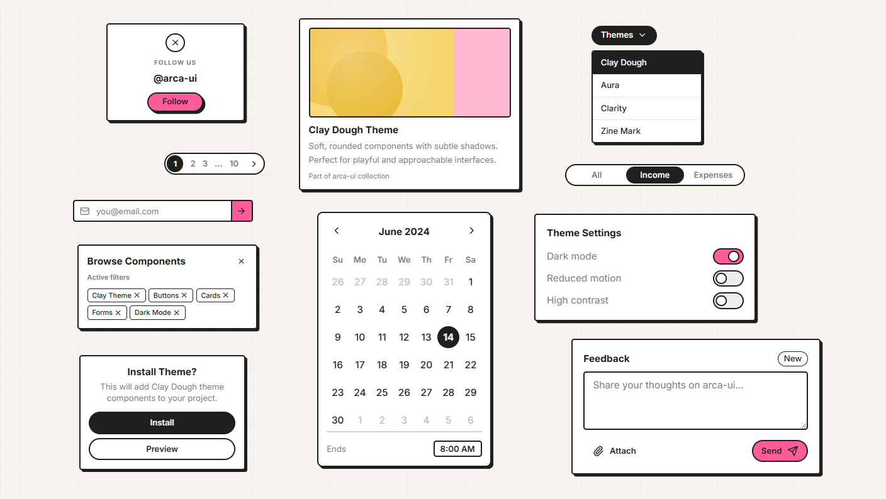
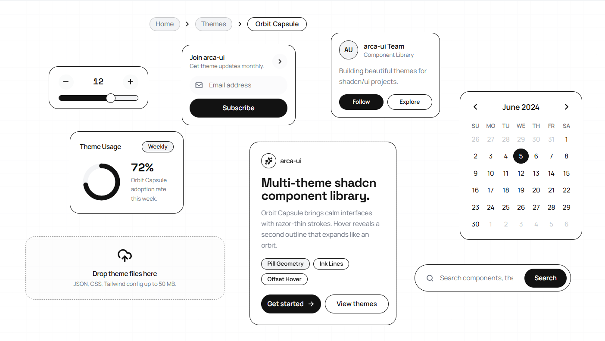
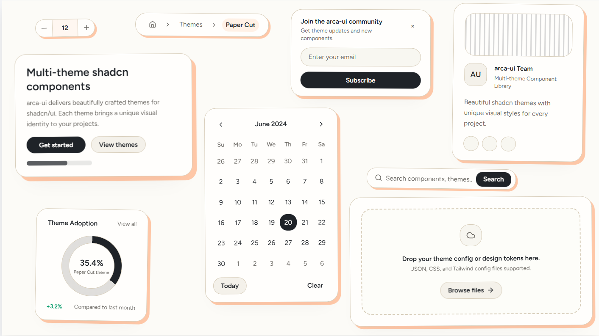
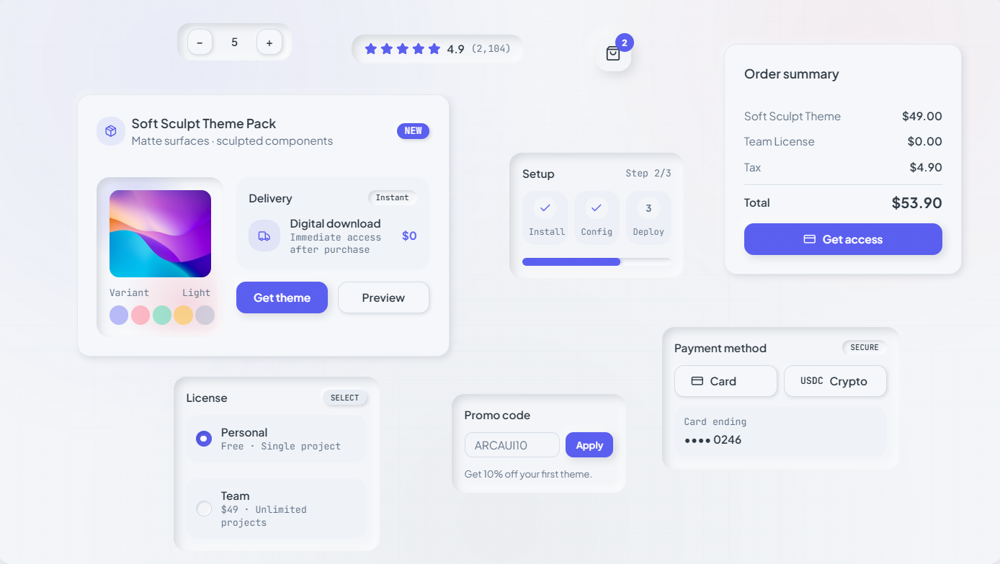
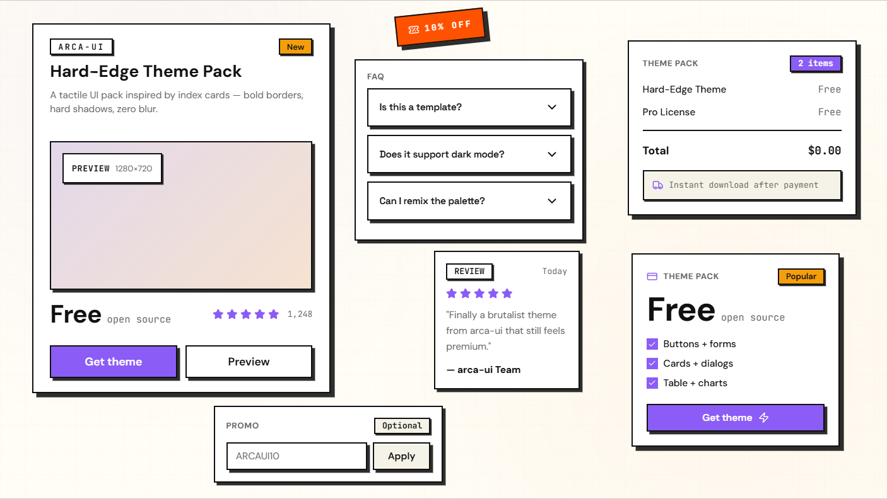
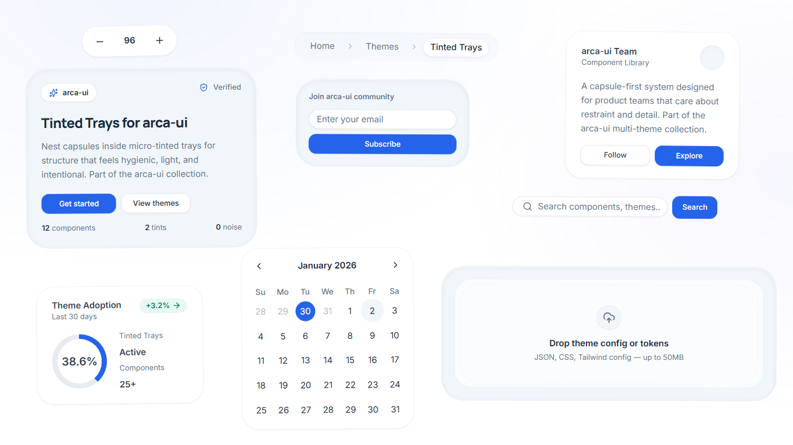
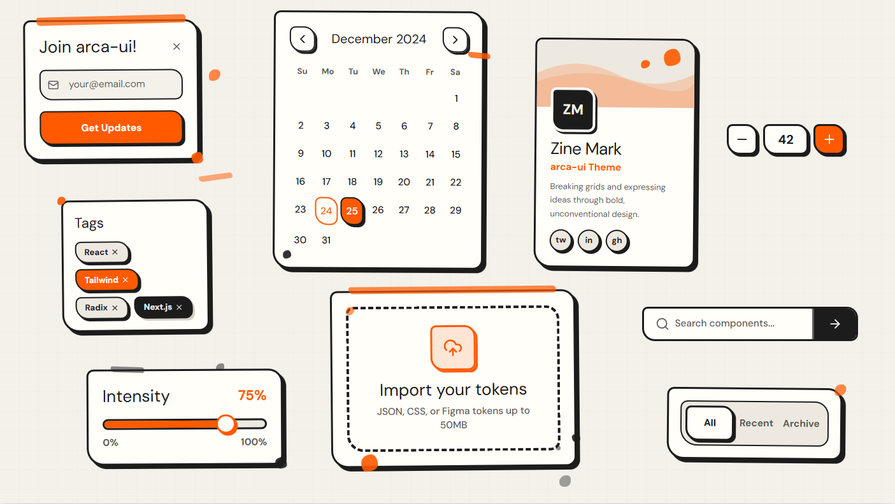

# Arca UI

A multi-theme component library built in the style of shadcn/ui.

## Themes Preview

| Theme | Preview |
|-------|---------|
| Aura |  |
| Charity |  |
| Clay Dough |  |
| Orbit Capsule |  |
| Paper Cut |  |
| Soft Sculpt |  |
| Solid Stack |  |
| Tinted Trays |  |
| Zine Mark |  |

## Development Workflow

Each theme follows a structured development process:

1. **Internal Brainstorming** - Create initial mockups and preview concepts
2. **Initial Development** - Build the first version of the component library
3. **Extensive Testing** - Test thoroughly across blocks and sections
4. **Stable Release** - Publish the stable version
