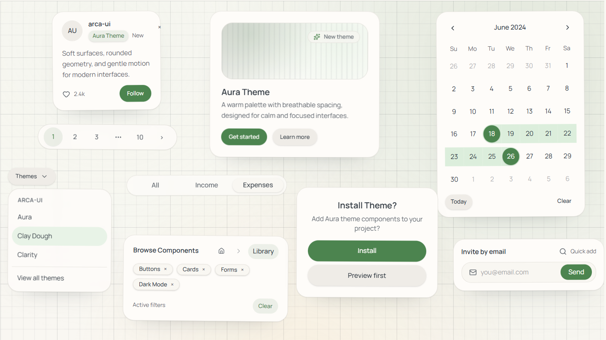
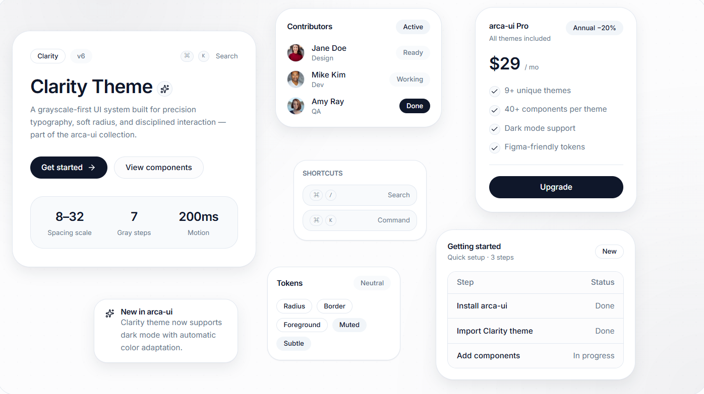
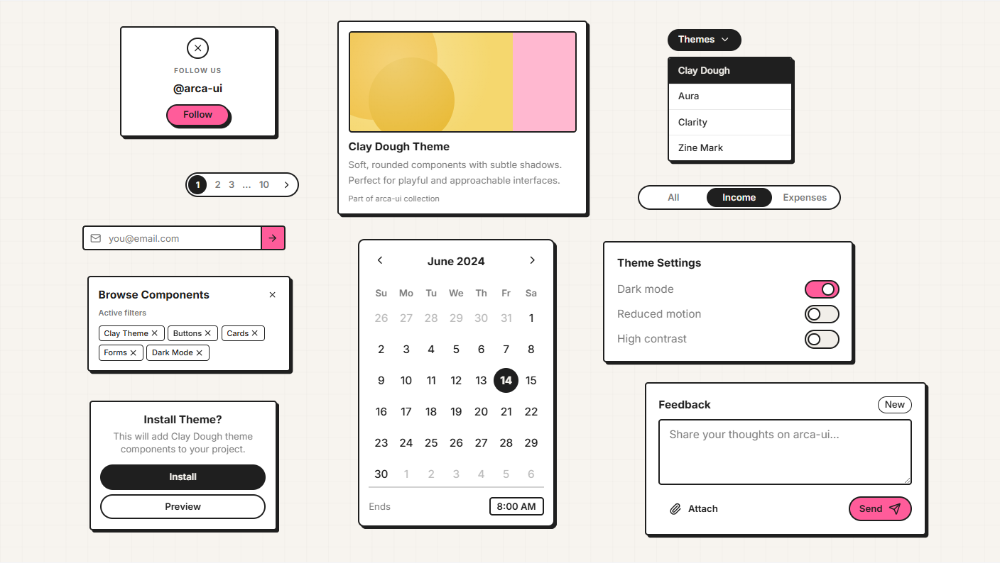
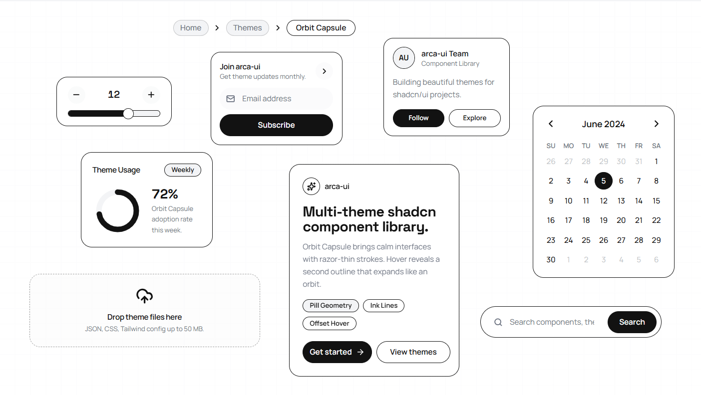
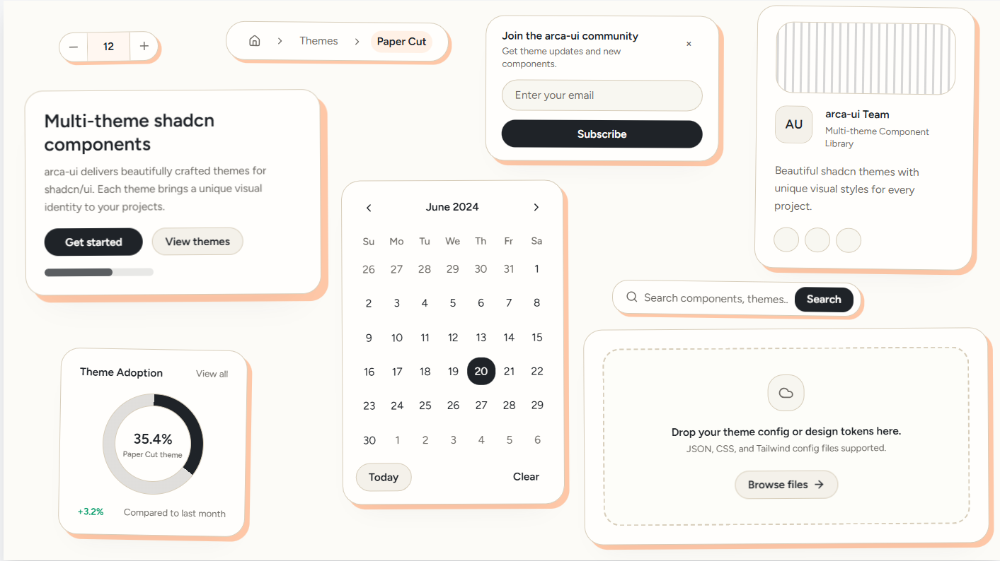
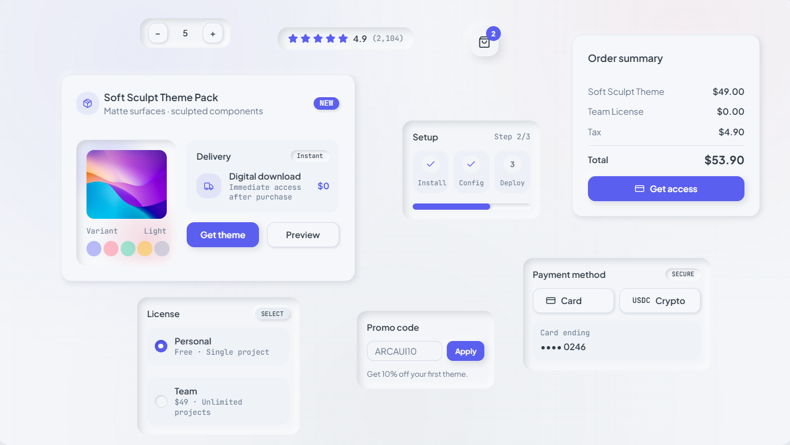
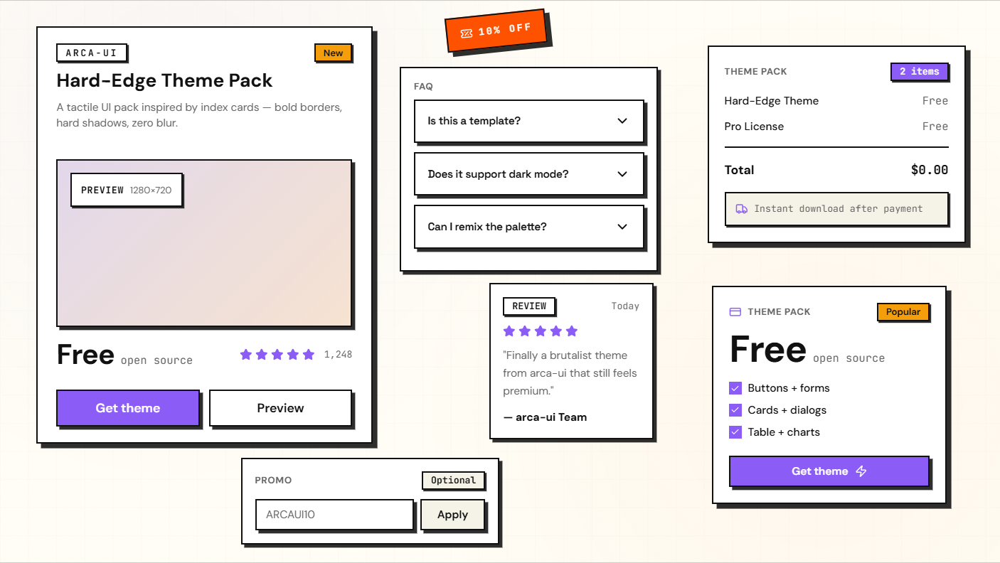
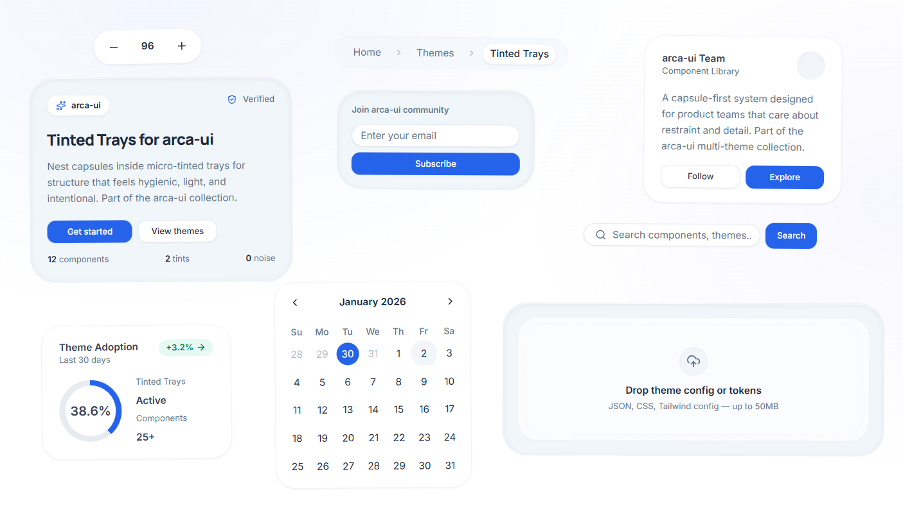
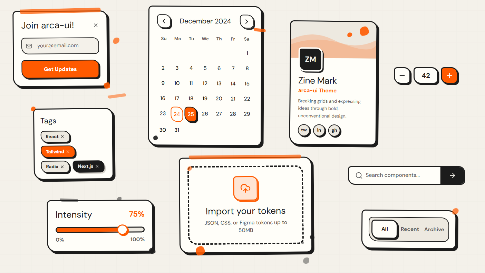

# Arca UI

A multi-theme component library built in the style of shadcn/ui: [arcaui.com](https://arcaui.com)

Arca UI started as a deep dive into AI site-building agents. While the agent itself is on hiatus, the challenge pushed me to figure out how to achieve high-fidelity, consistent front-end architecture.

The experiment left me with a massive pile of discarded workflows and legacy code. Instead of letting it go to waste, I decided to refactor the chaos into a structured, multi-theme component library built on top of shadcn/ui. I am building Arca UI to share these pre-optimized blocks with fellow builders—saving you the hundreds of hours typically lost to styling, so you can focus entirely on shipping.

The entire development process is 100% AI-driven. I’m documenting the journey, and as each theme reaches its official release, I will share the specific prompts tailored for Codex and Claude Code so you can reproduce or extend the results.

Right now, 5 themes are available as early drafts. I have 4 more launching soon and another 3 in the pipeline. Over the next 3 to 5 months, I’ll be running these components through automated workflows to battle-test them in real-world scenarios, iterating everything into a stable v1.0 release.

## Themes Preview

| Theme | Preview |
|-------|---------|
| Aura |  |
| Charity |  |
| Clay Dough |  |
| Orbit Capsule |  |
| Paper Cut |  |
| Soft Sculpt |  |
| Solid Stack |  |
| Tinted Trays |  |
| Zine Mark |  |

